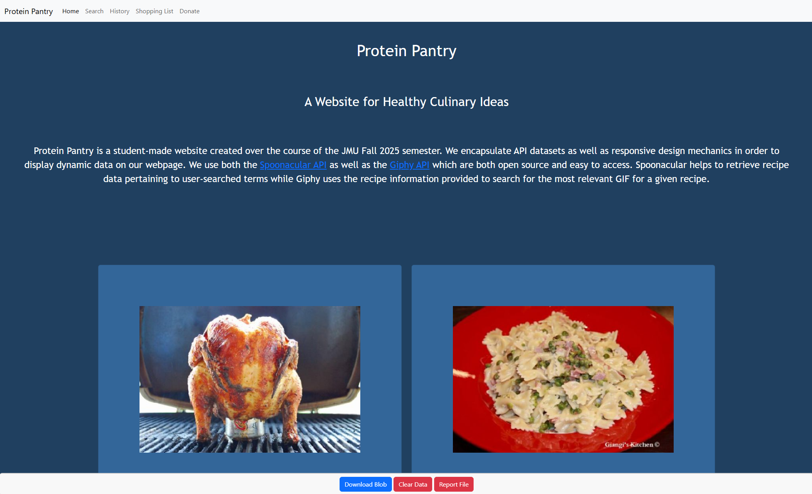

# Protein Pantry

**Protein Pantry** is a student-built website created as part of the JMU Fall 2025 semester. It delivers healthy culinary ideas using real-time data from public APIs. The app features responsive design and dynamic content based on user input, focusing on high-protein meal suggestions.

---

## 🌐 Demo

Below is a screenshot of the homepage:

> You can clone the repo and open `index.html` in your browser to try it locally.

---

## Features

- 🍗 Search for nutritional recipes using keywords
- 🔎 Fetch nutritional data from the **Spoonacular API**
- 🎬 Display relevant GIFs from **Giphy API**
- 📝 Keep track of past searches with a search history
- 🛒 Build and manage a shopping list
- 💻 Fully responsive layout for desktop and mobile

---

## Technologies Used

- **Frontend**: HTML5, CSS3, JavaScript
- **APIs**:
  - [Spoonacular API](https://spoonacular.com/food-api)
  - [Giphy API](https://developers.giphy.com/)
- **No frameworks** — built using vanilla JS and DOM manipulation

---
